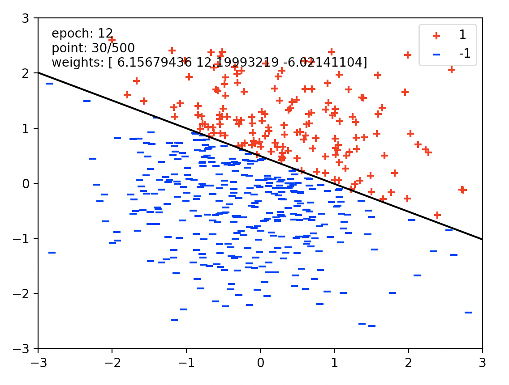
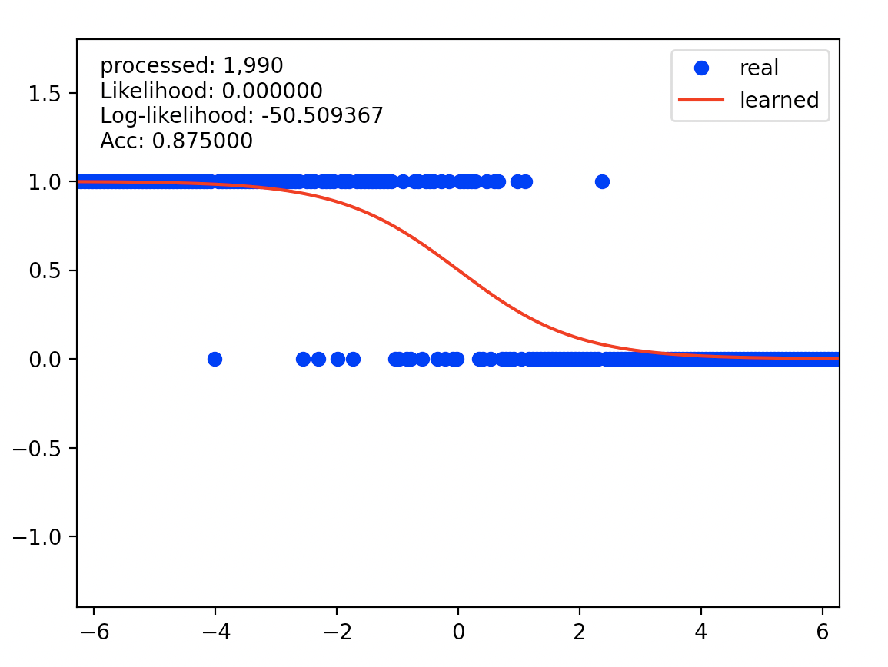
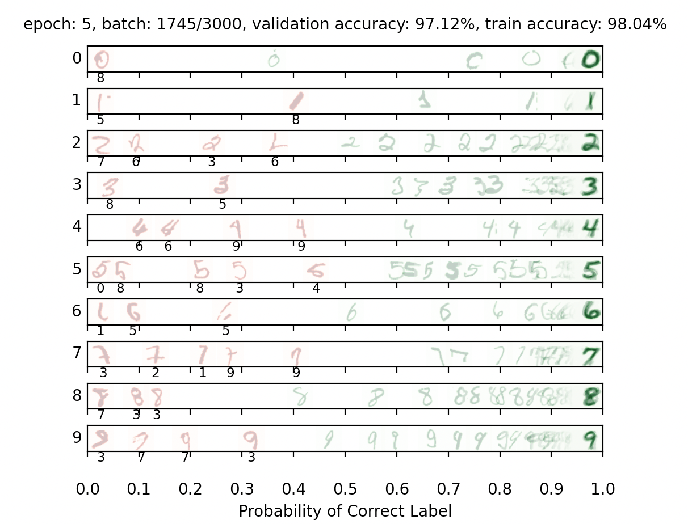

# Various_Intro_To_Machine_Learning
  
## Part 1 Perceptron
In this part, I used perceptron trying to separate a randomly generated data points which is linearly separable.  
For the perceptron, the output labels will be either 1 or −1, meaning that data points (x, y) from the
dataset will have y be a nn.Constant node that contains either 1 or −1 as its entries.  
My perceptron implementation worked well in finding the line of separation between the two datasets.  

## Part 2 Logistic Regression
For this part I am trying to fit the logistic regression to a randomly generated data, for which the log-likelihood of the data given my model achieved -50.5.  

## Part 3 Digit Classification
For this part I implemented a generic neural network class and then trained it to classify hand-drawn digits from the MNIST dataset.  
  
  
The dataset to use contains digit images. Each digit is of size 28 × 28 pixels, the values of which are stored in a 784 -dimensional vector of floating point numbers. Each output we provide is a 10-dimensional vector which has zeros in all positions, except for a one in the position corresponding to the correct class of the digit. The output will indicate the score for a digit belonging to a particular class (0-9).  

I was able to achieve a train accuracy of 98% and high, final validation accuracy of 97.5%.

